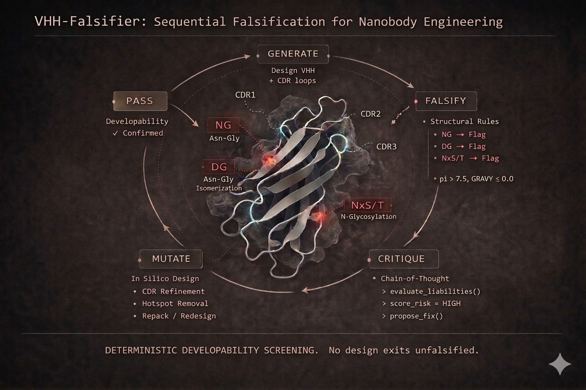
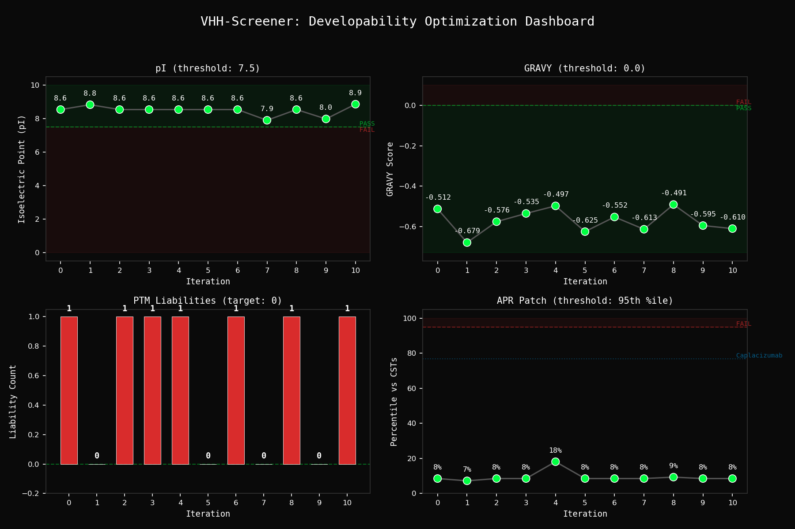

# VHH-Falsifier: Agentic Sequential Falsification for Nanobody Engineering



## What This Does

An LLM agent designs VHH nanobody sequences, then immediately tries to break them. Deterministic tools scan for manufacturing liabilities (deamidation, aggregation, glycosylation). If anything fails, the agent mutates the design and re-tests. The loop repeats until the candidate passes every check — or the iteration budget runs out.

No design exits the loop unfalsified.

## The Loop

```
GENERATE → FALSIFY → CRITIQUE → MUTATE → RE-FALSIFY → ... → PASS
```

1. Generate — Propose a VHH sequence with CDR loops targeting the binding epitope.
2. Falsify — Run all four deterministic tools against the candidate.
3. Critique — Diagnose each failure: exact motif, position, mechanism, clinical consequence.
4. Mutate — Apply point mutations to fix liabilities while preserving binding geometry.
5. Re-Falsify — Re-test from scratch. Repeat until clean.

## Technical Heritage

Zero-shot binding strategy adapted from the [Escalante 180-line approach](https://blog.escalante.bio/180-lines-of-code-to-win-the-in-silico-portion-of-the-adaptyv-nipah-binding-competition/), extended with a developability falsification layer.

## Falsification Tools

### Liability Scanning (PTM Hotspots)

Deterministic regex — no LLM inference, no stochastic variation.

| Liability | Motif | Mechanism |
|---|---|---|
| Deamidation | NG, NS, NA | Asparagine deamidation via succinimide intermediate |
| Isomerization | DG | Aspartate isomerization to iso-Asp |
| N-Glycosylation | N-X-S/T (X != P) | Aberrant glycosylation at consensus sequons |

### Biophysical Profiling (pI / GRAVY)

- pI < 7.5 → precipitation risk near physiological pH
- GRAVY > 0.0 → elevated hydrophobicity, aggregation-prone

### Aggregation-Prone Region Scanner (APR)

Sliding-window hydrophobicity analysis (7-residue window, Kyte-Doolittle scale) calibrated against 13 clinical-stage VH/VHH domains. Patches are scored as z-scores and percentiles against the clinical distribution. A design is falsified only if its worst patch exceeds the 95th percentile of successfully manufactured antibodies (threshold: 1.934 mean KD/residue). Caplacizumab (first approved VHH) validates at the 40.5th percentile.

### VHH Hallmark Audit (FR2 Tetrad)

Checks Kabat positions 37, 44, 45, 47 for camelid vs. human VH identity:

| Kabat Position | Camelid | Human VH | Role |
|---|---|---|---|
| 37 | F | V | Core packing; compensates for missing VL |
| 44 | E | G | Hydrophilic substitution at former VH-VL interface |
| 45 | R | L | Charged residue replacing hydrophobic VL contact |
| 47 | G | W | Flexible Gly replacing bulky Trp |

## Architecture

```
agent_loop.py                    biologics_server.py
┌─────────────────────┐          ┌──────────────────────────────┐
│  LLM Agent          │          │  FastMCP Server              │
│  (DeepSeek V3 /     │  tools   │                              │
│   Together AI)      │────────→ │ scan_structural_liabilities  │
│                     │          │ calculate_biophysical_profile│
│  Generate → Falsify │←──────── │ vhh_hallmark_audit           │
│  → Critique → Mutate│  JSON    │                              │
└─────────────────────┘          └──────────────────────────────┘
        │
        ▼
  logs/agent_cot.log
```

- `biologics_server.py` — FastMCP server, four deterministic tools, structured JSON output.
- `agent_loop.py` — Falsification loop via OpenAI-compatible API. Per-iteration cost tracking. Green CoT terminal output, logged to `logs/agent_cot.log`.

### Developability Dashboard



The dashboard is generated automatically at the end of each run, tracking all four developability metrics across iterations.

## Quickstart

```bash
git clone https://github.com/ChristopherSNelson/VHH-Falsifier.git
cd VHH-Falsifier
pip install fastmcp biopython openai
export TOGETHER_API_KEY="your-key-here"
python agent_loop.py
```

| Environment Variable | Default | Description |
|---|---|---|
| `TOGETHER_API_KEY` | *(required)* | Together AI API key |
| `MODEL_ID` | `deepseek-ai/DeepSeek-V3` | Any OpenAI-compatible model on Together |

## Developability Constraints

Hard requirements. Nothing passes unless all are satisfied.

| Constraint | Threshold | Rationale |
|---|---|---|
| Isoelectric point | pI > 7.5 | Avoid precipitation near physiological pH |
| Hydropathy | GRAVY <= 0.0 | Minimize aggregation propensity |
| Aggregation-prone regions | Below 95th percentile of CSTs | Clinically-calibrated patch detection |
| Deamidation motifs | Zero in CDRs | Eliminate shelf-life degradation risk |
| Isomerization motifs | Zero in CDRs | Prevent charge heterogeneity |
| N-Glycosylation sequons | Zero in CDRs | Ensure batch consistency |
| FR2 hallmark tetrad | Assessed and documented | Structural integrity of VHH scaffold |

### References

APR calibration set: Jain et al. (2017) PNAS 114(5):944-949; Raybould et al. (2019) TAP dataset.

## Roadmap: Toward Autonomous Biologics Discovery

VHH-Falsifier is a functional prototype of agentic sequential falsification. Future iterations will transition from sequence-level heuristics to structural physics and state-of-the-art ML.

### 1. Structural Falsification (Spatial Physics)

SASA-aware liabilities: Integrate BioPython PDB or FreeSASA to context-qualify PTM motifs (e.g., NG deamidation). A liability is only falsified if its solvent accessible surface area exceeds 25 A^2, preventing the rejection of stable, buried residues.

Interface delta-G via folding: Invoke Boltz-2 to predict VHH-antigen complex structures and calculate binding energy and interface RMSD, moving beyond zero-shot sequence guessing to structural validation of CDR3 loop geometry. Boltz-2 outperforms AlphaFold-Multimer on antibody-antigen docking and supports protein, nucleic acid, and small molecule inputs under an MIT license.

### 2. High-Fidelity Developability (TDC Alignment)

Spatially-resolved aggregation: Upgrade from global GRAVY scores to Spatial Aggregation Propensity (SAP) mapping. This identifies local hydrophobic patches specifically on the solvent-exposed surface of the VHH, aligning with Therapeutics Data Commons (TDC) benchmarks like TAP.

Inverse folding: Replace stochastic mutation with an AntiFold layer to generate sequence manifolds pre-optimized for the target scaffold's 3D coordinates. AntiFold is purpose-built for antibody inverse folding with better CDR sequence recovery than general-purpose tools like ProteinMPNN.

### 3. Next-Gen Immunogenicity Falsification

Presentation-aware screening: Move beyond legacy NetMHCpan to BigMHC, a deep learning ensemble that predicts peptide presentation on the cell surface (mass spec ground truth) rather than just binding affinity.

OAS-perplexity scoring: Use AbLang2 or AntiBERTa2 to calculate the naturalness (log-likelihood) of the VHH sequence relative to the Observed Antibody Space (OAS). These antibody-specific language models provide perplexity scores that reflect actual immunogenicity risk, unlike general protein models (ESM-2) that lack repertoire-level calibration. Any design with high perplexity (statistical deviation from human germline distributions) is falsified as a high immunogenicity risk.

### 4. Complex Search and Optimization

Monte Carlo Tree Search (MCTS): Transition from a linear loop to an MCTS-based mutation strategy, allowing the agent to explore multiple parallel mutation branches and prune those that fail early developability checks.

Multi-agent red teaming: Implement a Generator vs. Falsifier adversarial debate, where the Generator is incentivized to find exploits in the Falsifier's deterministic rules, driving higher scaffold robustness.

## License

MIT

## Author

Chris Nelson

- [LinkedIn](https://www.linkedin.com/in/christopher-s-nelson/)
- [GitHub](https://github.com/ChristopherSNelson)
